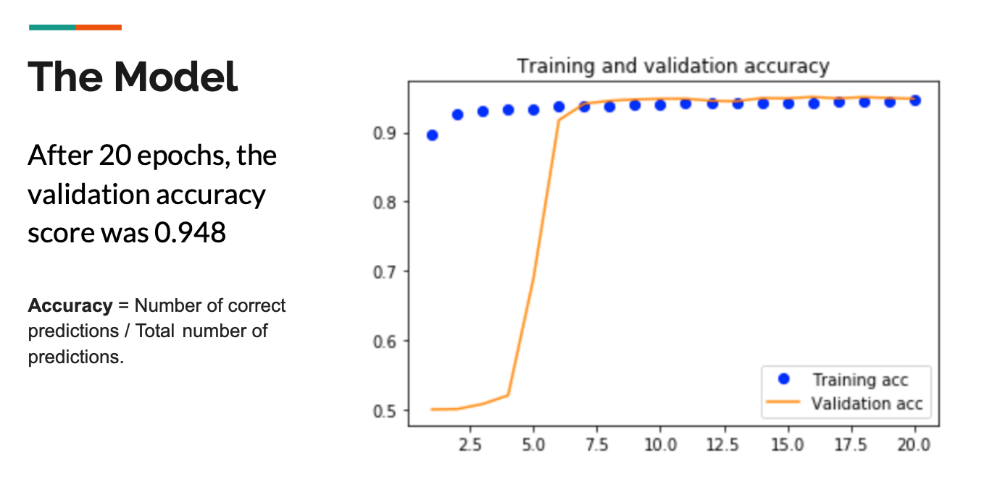

## A Melanoma Classifier Using a Convolutional Neural Network with ResNet-50  Pre-Trained Model
*Author: Joshua Leibow (LA)*
***
## Executive Summary:

### Problem Statement:  
Skin cancer is the most common cancer in the U.S. and worldwide, of which melanoma is the most dangerous.  If left untreated, melanoma will typically spread to other areas of the body, including organs.

Given that men are twice as likely than women to die of melanoma and that early detection has a 99% survival rate, there is an incentive to help people detect their melanomas early.  Also, since most people, especially men, do not regularly visit a dermatologist, a smart phone app with a trained classification model that can detect skin cancer, can help someone get a reality check from the comfort of their own home.  If such a person were to receive a positive reading, he/she would likely be quite motivated to book an appointment with his/her local dermatologist.  At the appointment, the doctor can give a professional diagnosis, one that may agree or disagree with a smart phone app.  Regardless, the patient will have been proactive with his/her health, have a higher chance of receiving an early stage diagnosis, and be more willing to take the necessary steps towards treatment.  

Background:

mel·a·no·ma
/ˌmeləˈnōmə/

a tumor of melanin-forming cells, especially a malignant tumor associated with skin cancer.
"melanomas can appear anywhere on the body"[1]

 A few statistics from the [Skin Cancer Foundation](https://www.skincancer.org/skin-cancer-information/skin-cancer-facts/)[2] reveal that:

- 1 in 5 Americans will develop skin cancer by the age of 70.  
- More than 2 people die of skin cancer in the U.S. every hour.  
- Having 5 or more sunburns doubles your risk for melanoma.  
- When detected early, the 5-year survival rate for melanoma is 99 percent.  
- The annual cost of treating skin cancers in the U.S. is estimated at $8.1 billion: about $4.8 billion for nonmelanoma skin   cancers and $3.3 billion for melanoma.  
- In the past decade (2010 – 2020), the number of new invasive melanoma cases diagnosed annually increased by 47 percent.  
- An estimated 6,850 people will die of melanoma in 2020. Of those, 4,610 will be men and 2,240 will be women.
 
- The vast majority of melanomas are caused by the sun. In fact, one UK study found that about 86 percent of melanomas can be - attributed to exposure to ultraviolet (UV) radiation from the sun.
- Across all stages of melanoma, the average five-year survival rate in the U.S. is 92 percent. The estimated five-year survival rate for patients whose melanoma is detected early is about 99 percent. The survival rate falls to 65 percent when the disease reaches the lymph nodes and 25 percent when the disease metastasizes to distant organs.
- Only 20 to 30 percent of melanomas are found in existing moles, while 70 to 80 percent arise on apparently normal skin.
- On average, a person’s risk for melanoma doubles if they have had more than five sunburns, but just one blistering sunburn in childhood or adolescence more than doubles a person’s chances of developing melanoma later in life.
- Women age 49 and under are more likely to develop melanoma than any other cancer except breast and thyroid cancers.
- From age 50 on, significantly more men develop melanoma than women.

## The ABCDEs of Diagnosing Melanoma:
1. Asymmetry - 1/2 of the mole is different than other 1/2
2. Border - irregularity
3. Color -  not uniform
4. Diameter - greater than 6 mm in size (pencil eraser)
5. Evolving - recent changes in size, shape or color.

"Another clinical finding associated with melanoma is the “ugly duckling sign”, also called outliers. This refers to a mole that differs significantly in appearance from other moles on the patient; such moles are more likely to be a melanoma. In a prospective study using unaided and dermoscopic images, the ugly duckling sign was more sensitive when defined as any lesion perceived as different from other moles. It was more specific when defined as any lesion perceived as completely different.5

"Dermoscopy is an office technique in which a magnifier is placed on skin that is covered with liquid. By using cross-polarized light, it is possible to see structures in the epidermis and superficial dermis that are not visible to the naked eye, thus allowing for better recognition of the ABCD signs of melanoma."[3]

## My Dataset:
### HAM10000
Over 10,000 Images classified into 7 common pigmented skin lesions: 
1. Actinic Keratoses
2. Basal cell carcinoma
3. Benign keratosis
4. Dermatofibroma
5. Melanocytic nevi
6. Melanoma
7. Vascular Skin Lesions

The dataset was then classified into 2 classes:
1. Melanoma 
2. Not Melanoma 

And uploaded to Kaggle.com.  [Click here](https://www.kaggle.com/drscarlat/melanoma) to link to the dataset.

## My Model:
A Convolutional Neural Network (CNN) that incorporates a pre-trained CNN model known as ResNet50.  

"ResNet-50 is a convolutional neural network that is trained on more than a million images from the ImageNet database. The network is 50 layers deep and can classify images into 1000 object categories, such as keyboard, mouse, pencil, and many animals. As a result, the network has learned rich feature representations for a wide range of images. The network has an image input size of 224-by-224."[4]

### Model Attributes and Layers:
- Sequential Model
- ResNet50 - 176 total layers
- Flatten Layer
- Dropout Layer - rate = 0.4
- Dense Layer with 562 neurons, relu activation, L2 rg - 0.003 penalty
- Dropout layer - rate = 0.3
- Dense layer with 2 neurons and Sigmoid Activation
- 79,987,224 total parameters
***
# Validation Loss

***
# Validation Accuracy

***
## Basic CNN Model for Comparison:

- Sequential  Model
- Flatten Layer
- Dropout Layer - rate = 0.4
- Dense Layer with 128 neurons, relu activation
- Dense Layer with 32 neurons, relu activation
- Dense Layer with 1 neuron, sigmoid activation
- 19,271,873 total parameters
***
# Validation Loss of the Basic CNN Model

***
# Validation Accuracy of the Basic CNN model

## Conclusion:

The Pre-trained ResNet50 Model gave significantly better accuracy and loss scores than the basic CNN model.

## Future possibilities to achieve even higher accuracy scores:

1. More data that uses  smartphone pictures people upload to the app.
2. New and improved Machine Learning Models
3. Train a model on enhanced images such as those created by Dermoscopy
4. Use Dermoscopy images

## Stretch Goals:

1. Create an iphone/android app in conjunction with a sofware engineer and a UX designer
2. Deploy to the app store and create social media awareness for the app.
3. Make it like Venmo such that you can see when your friends uploaded pictures of their moles.
4. Use this app as inspiration to create more health apps that utilize machine learning.

## Sources:

1. Google dictionary definition of Melanoma
2. The Skin Cancer Foundation - https://www.skincancer.org/skin-cancer-information/skin-cancer-facts/
3. Dermoscopy definition - https://www.aafp.org/afp/2008/1115/p1205.html
4. ResNet50 definition - https://www.mathworks.com/help/deeplearning/ref/resnet50.html

### Slides to the Presentation are [available here.](./assets/Melanoma_or_Not_Melanoma.pdf)

